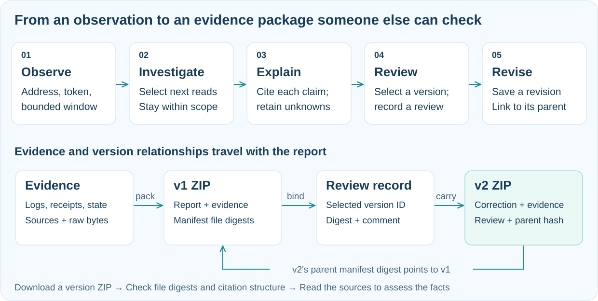

[](README.md) [](README.en.md)

# ClueTide · GCC

**Turn an Ethereum event into an explanation someone else can verify.**

[Try the demo](https://hnnuyuxuan.github.io/cluetide-app/gcc/) · [ClueTide overview](https://github.com/HNNUYUXUAN/cluetide-review/blob/main/README.en.md) · [Explore BOT](https://github.com/HNNUYUXUAN/cluetide-review/tree/BOT)

A large transfer raises a question. Passing a conclusion to a teammate raises another: can they follow the evidence and reach their own judgment? We built ClueTide GCC to connect those moments. It is an Ethereum investigation and evidence-review workbench where observations lead to bounded follow-up reads, claims retain citations, and corrections remain connected to the version they revise.


*Product concept illustration. Actual workbench and replay screens appear below.*

## Start with 100 million UNI

Open the [UNI case](https://hnnuyuxuan.github.io/cluetide-app/gcc/#/demo/uniswap93) and follow one concrete event. In the **21-block window from 24106368 to 24106388**, a Timelock transfers **100,000,000 UNI** to the dead address. The receipt supports successful execution, while proposal 93 provides governance context to compare with the transaction.

Now inspect the adjacent supply observations. Both `totalSupply()` reads return **1,000,000,000 UNI**. The transferred amount and the token's total supply are separate claims, each requiring its own evidence. That distinction shapes the explanation and the questions that remain open.

We start an investigation with an address, an ERC-20 token and a bounded block window. The agent can choose follow-up reads for receipts, transactions, historical token state and source material, subject to request limits and the selected scope. The report carries citations, explanations and explicit unknowns. Its tool trace and quality flags help you see how the available evidence supports the conclusion and where another check would be useful.


*Actual product screen. The current UI is in Chinese, including in these English instructions.*

## Give the next person a version they can examine

We attach a review to a specific saved version. Select v1 and the review records v1's version ID and content digest. The author saves a correction against the current parent to create v2. The original version stays available, and the new report records its parent's manifest digest, so the next reader can identify exactly which evidence package the correction continues.

Switch between v1 and v2 in the UNI replay to see the supply boundary become part of the explanation. The public replay combines historical public observations with clearly labelled synthetic reports. It demonstrates the investigation and correction flow. With the local service running, you can submit your own review, edit an explanation and save a new version. Author and reviewer identities in that service are controlled local demo roles.


*Actual Chinese UI: synthetic v1 / v2 reports and their parent-version relationship.*

For the handoff, download the selected version's ZIP and open it in the evidence verifier. Your browser reads the file locally and checks its file digests and citation structure. The replay also checks that v2's parent digest matches v1. Hashes establish byte consistency; interpreting the facts still requires reading the original sources.

Each case retains raw requests and responses, source pointers and SHA-256 digests so the next person can trace an observation back to its capture. The remote finalized anchor is reported by the RPC provider. Provider trust, byte consistency and the strength of an explanation each need to be assessed on their own terms.

Then try the [Euler DAI case](https://hnnuyuxuan.github.io/cluetide-app/gcc/#/demo/euler-20230313). Its **three-block window, 16817995–16817997**, contains one outgoing and two incoming transfers for the selected subject. The same process preserves the precise net Transfer flow and its subject, token and window. Understanding the wider incident calls for further evidence.


*Actual Chinese UI: choose an evidence ZIP for local browser verification.*



## Take an investigation through the workflow

The [hosted demo](https://hnnuyuxuan.github.io/cluetide-app/gcc/) lets you explore both cases and carry their evidence packages into the browser verifier. Run the local service to create investigations and maintain your own case history.

| Experience | Hosted static demo | Local service |
| --- | :---: | :---: |
| UNI / Euler replays, v1 / v2 downloads, browser ZIP verification | ✓ | ✓ |
| Create investigations, save cases, inspect tool traces | — | ✓ |
| Server imports, exact-version reviews and corrections | — | ✓ |

Install **Python 3.12, Node.js 24 and npm**, then run in PowerShell:

```powershell
git clone --branch GCC --single-branch https://github.com/HNNUYUXUAN/cluetide-review.git cluetide-gcc
Set-Location cluetide-gcc
python -m venv .venv
.\.venv\Scripts\python.exe -m pip install -r requirements-lock.txt
Push-Location frontend
npm ci
npm run build
Pop-Location
.\scripts\run-local.ps1
```

Open the [local workbench](http://127.0.0.1:5186/). The launcher uses public-cache evidence and an offline model. One service serves the UI and `/api`, and saves cases under `local-data/`. Windows is the verified platform for this release. [Development notes](docs/DEVELOPMENT.md) cover configuration, tests and packaging; [validation records](docs/VALIDATION.md) describe the checks performed.

For Linux/macOS, use `python3.12 -m venv .venv`, install through `.venv/bin/python`, build the frontend as above, and start from the repository root with the command below. This shell recipe still needs platform-specific execution:

```bash
CLUETIDE_PREVIEW_ONLY=1 .venv/bin/python -m uvicorn cluetide.app:app --host 127.0.0.1 --port 5186
```

We retain the [UNI evidence](data/cases/uniswap93/README.md), [Euler evidence](data/cases/euler-20230313/README.md) and [source manifest](source-manifest.json) for further inspection. [SOURCE.md](SOURCE.md) identifies the source baseline and evidence provenance. Our code uses the [MIT license](LICENSE), with original [third-party attribution and terms](data/attribution/README.md) preserved. The [walkthrough](docs/REVIEW.md) provides a fuller route through the product.

[Image sources](docs/readme-assets.md)

Live investigations show observed stages, model requests and tool attempts, with direct paths to citations and exact-version review. See the [live investigation guide](docs/LIVE-DEMO.md) for local configuration and the hosted demo's capabilities.
