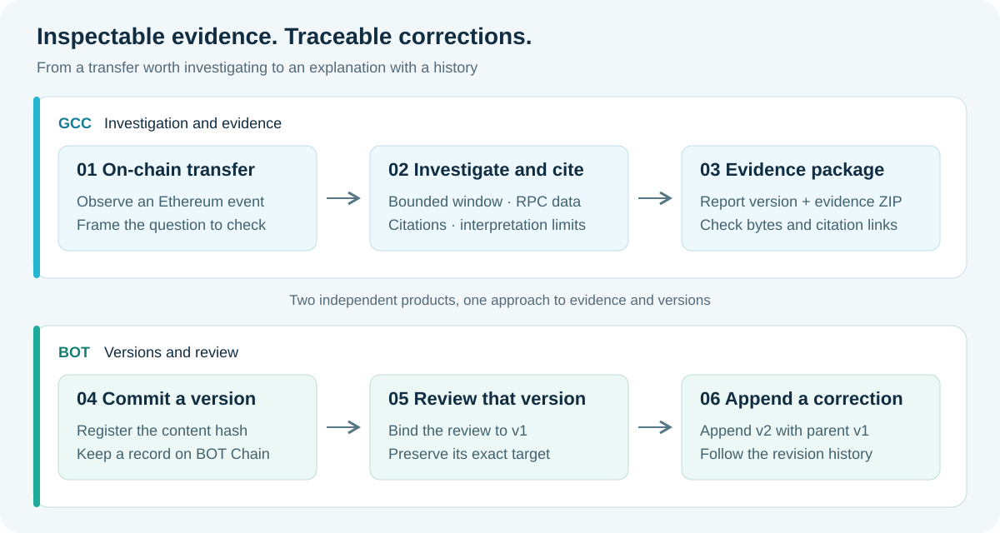
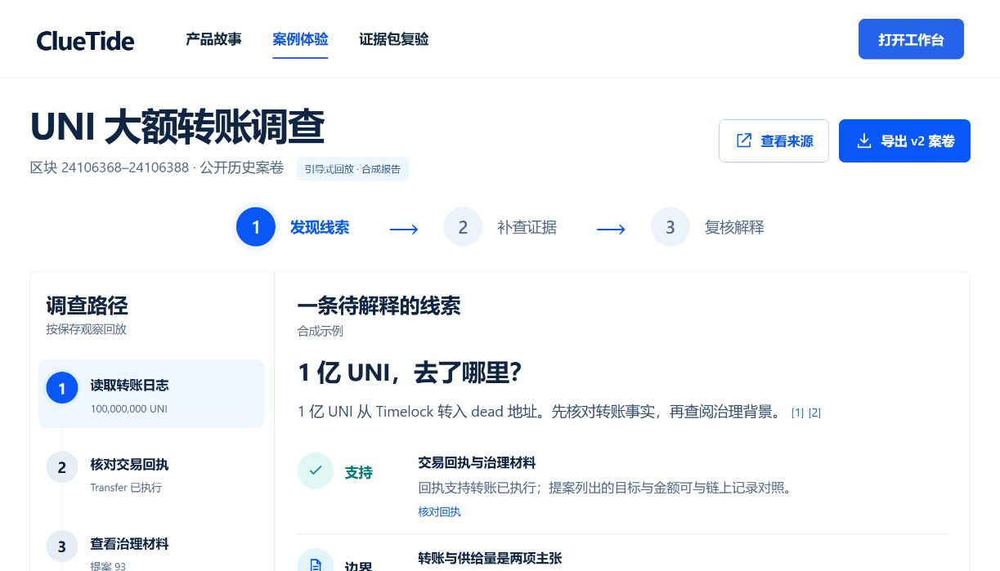
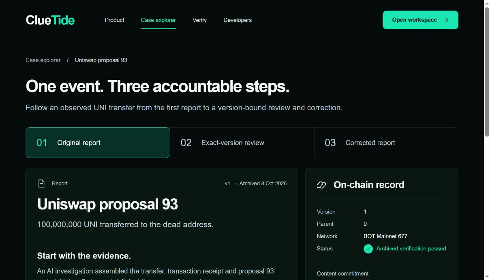

 

# ClueTide

**We make on-chain interpretations carry their evidence, and corrections preserve their history.**

*Product concept illustration: from on-chain investigation to evidence and version review.*

[**Explore GCC · Investigation and evidence →**](https://hnnuyuxuan.github.io/cluetide-app/gcc/)　[**Explore BOT · Versions and review →**](https://hnnuyuxuan.github.io/cluetide-app/bot/)

## Why we built ClueTide

A transfer worth investigating can support several competing explanations. We want readers to see which observations an explanation relies on, how far the investigation reaches, and what still needs checking. When new evidence changes the story, we also want to preserve who reviewed which version and how the correction relates to its predecessor.

We built two products around that working path. **GCC organizes investigations and evidence; BOT records content commitments and version-bound reviews.** Each product runs independently. Together, they express our approach to making explanations inspectable and corrections traceable.

## Start with a UNI transfer

**In GCC, follow how an explanation is supported.** We investigate historical Ethereum events within a bounded observation window, bringing raw RPC observations, source citations, candidate explanations, and open questions into one workspace. Open the UNI replay, then compare it with Euler. Follow a citation back to its evidence, inspect the report, and download the evidence ZIP. The browser verifier lets you examine the package's bytes and citation relationships.

*Actual GCC web interface. The replay combines public on-chain observations with explicitly labelled synthetic reports.*

**In BOT, follow how an explanation is reviewed.** We use real archived model reports for the UNI case to show v1, a review bound to v1, and a corrected v2 that retains v1 as its parent. Select a version, open its evidence package, and inspect its mainnet record. The same UNI case gives readers a route through both products; their reports and demonstration materials retain their own provenance.

*Actual BOT web interface showing an archived original model report and mainnet records.*

Our BOT Mainnet 677 archive contains four successful transactions: deployment, v1 registration, its exact-version review, and v2 registration. The [mainnet proof](https://hnnuyuxuan.github.io/cluetide-app/bot/mainnet/bot-mainnet-workflow-20261008.json) lets readers inspect those records. A content hash commits to evidence bytes; interpreting the facts still requires reading the evidence. The demonstration uses the same wallet for the author and reviewer roles.

## Try online, then run locally

| Product | Public static experience | Full local service |
| --- | --- | --- |
| **GCC** | UNI / Euler replays, reports, evidence ZIP downloads, and browser verification | Investigation API over bounded finalized windows, persistent cases, evidence import, and exact-version review |
| **BOT** | English version timeline, archived mainnet proof, and evidence-file verification | Investigation and case APIs, wallet transaction preparation, and receipt / contract readback for matching case records |

We suggest starting with the public examples to follow a complete case. Run the local service when you want to investigate your own question and save its results. Each product branch includes its environment requirements, locked dependencies, and startup instructions, so the next step is available beside the source.

## Source and development

| Product | Source and setup |
| --- | --- |
| **GCC** | [English development guide](https://github.com/HNNUYUXUAN/cluetide-review/blob/GCC/README.en.md) |
| **BOT** | [English development guide](https://github.com/HNNUYUXUAN/cluetide-review/tree/BOT) |

We maintain source, setup instructions, dependency locks, and validation notes with each product. Our own source uses the [MIT License](LICENSE); evidence materials and third-party components include their applicable provenance, attribution, and notices.

[Product release and validation](docs/release.md) · [Project and mainnet evidence](docs/submission.md) · [中文](README.md)

[Image sources](docs/readme-assets.md)
