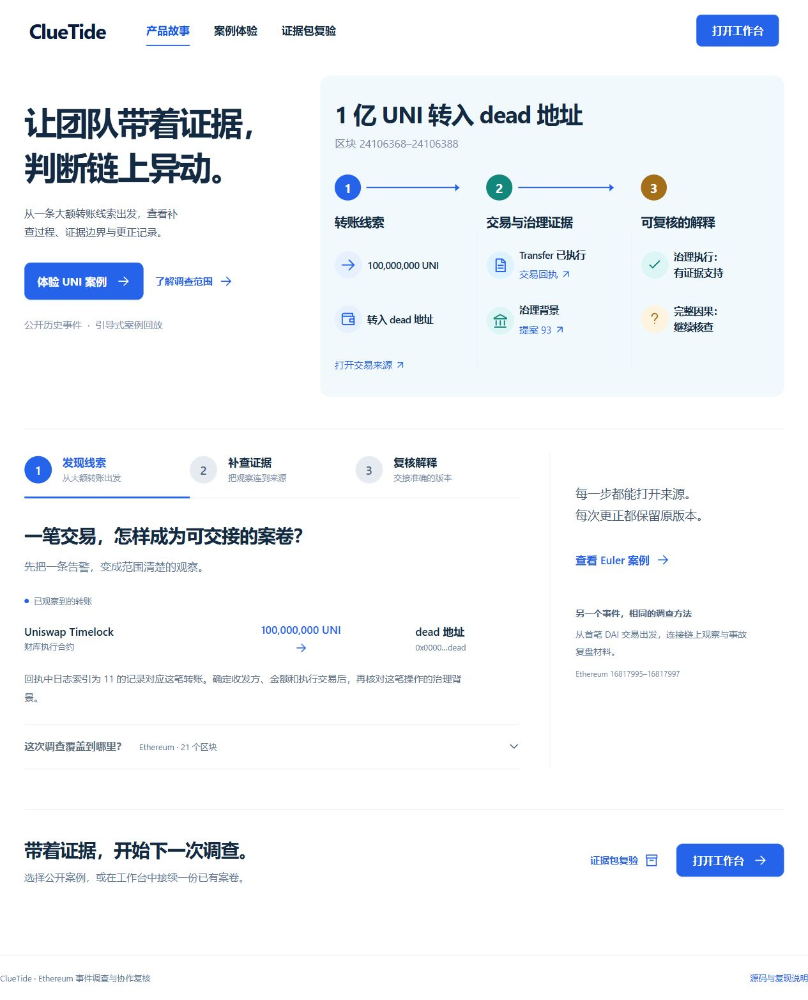
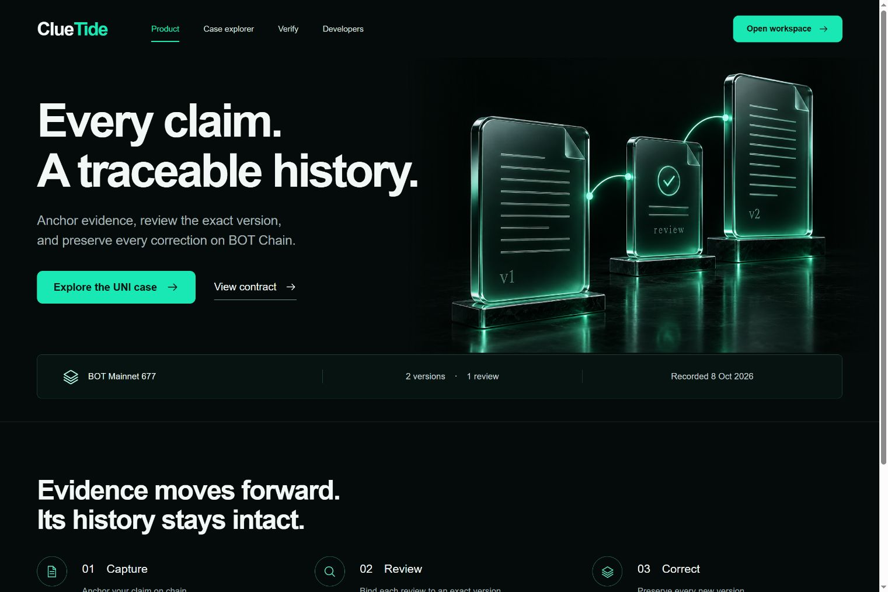
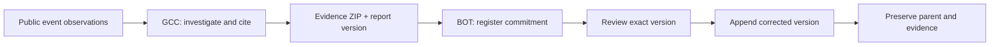

# ClueTide

**从链上事件到可复核证据。From on-chain events to reviewable evidence.**

ClueTide 将事件调查、证据解释和版本协作连接起来。本仓库为作品评审及开源准备入口；请选择对应赛道分支查看完整源码、启动方式和演示。

ClueTide connects event investigation, evidence interpretation, and version-aware collaboration. This repository is the review release and preparation point for open-source publication. Each track has its own source, setup guide, and demo.

| 赛道 / Track | 评审重点 / Review focus | 源码 / Source | 在线体验 / Live demo |
| --- | --- | --- | --- |
| **GCC** | Ethereum 事件调查、证据引用、解释边界与协作更正 / Bounded investigation, citations, interpretation, and corrections | [GCC · 双语 README / bilingual guide](https://github.com/HNNUYUXUAN/cluetide-review/tree/GCC) | [GCC Demo](https://hnnuyuxuan.github.io/cluetide-app/gcc/) |
| **BOT** | BOT Chain 证据版本登记、准确版本复核、父版本承接 / Evidence commitments, exact-version review, and lineage on BOT Chain | [BOT · English README](https://github.com/HNNUYUXUAN/cluetide-review/tree/BOT) | [BOT Demo](https://hnnuyuxuan.github.io/cluetide-app/bot/) |

## 三分钟评审路线 · A three-minute review

1. **GCC：观察 → 解释。** 打开 UNI 回放，再切换 Euler。检查观察窗口、原始来源、候选解释和待核事项，下载证据包并在复验工具中打开。
2. **BOT：版本 → 复核 → 更正。** 沿 UNI 案卷查看 v1、绑定 v1 的复核及承接 v1 的 v2；打开真实 BOT 测试网交易，核对每一步的版本和内容承诺。
3. **复现。** 在所选赛道分支按 README 安装锁定依赖，运行本地完整服务，检查调查、导出、导入、复核和更正路径。

1. **GCC: observation → interpretation.** Open the UNI replay, then Euler. Inspect the bounded window, source observations, candidate explanations, and unresolved questions. Download a bundle and open it in the verifier.
2. **BOT: version → review → correction.** Follow the UNI case through v1, its version-bound review, and v2 with its parent preserved. Open the recorded BOT testnet transactions and inspect each commitment.
3. **Reproduce.** Follow the selected branch's README to install locked dependencies and run the full local service, including investigation, export, import, review, and correction.

## GCC · 调查与证据 / Investigation and evidence

GCC 围绕 UNI 与 Euler 的公开历史事件组织调查。有限窗口、原始 RPC 观察、来源引用、报告版本和证据 ZIP 共同确定结论的可核查范围。

GCC organizes investigations around public UNI and Euler events. Bounded windows, raw RPC observations, citations, report versions, and evidence ZIPs define what a conclusion can support.

## BOT · 证据版本 / Evidence provenance

BOT 将内容承诺、指定版本的复核以及父子版本关系写入 `ClueTideRegistry`。演示读取 2026-10-08 归档的真实测试网记录：两个版本、一次复核、三笔业务交易。

BOT records content commitments, reviews bound to exact versions, and parent-child relationships in `ClueTideRegistry`. The demo presents real testnet records archived on 8 October 2026: two versions, one review, and three transactions.

## 演示范围 · Demo scope

在线站点由 GitHub Pages 托管。GCC 提供公开案例回放、明确标注的合成版本和浏览器证据复验；BOT 提供英文产品体验、真实交易档案及证据文件校验。完整调查 API、持久化案件和钱包交易准备通过各分支的本地服务运行。页面准确区分归档记录、模拟报告和当前读取结果。

GitHub Pages hosts the browser demos. GCC provides public case replays, explicitly labelled synthetic versions, and browser evidence validation. BOT provides the English product experience, recorded transaction provenance, and evidence-file checks. The full investigation API, persistent cases, and wallet transaction preparation run in each track's local service. The interface distinguishes archived records, simulated reports, and current readbacks.

内容摘要证明对应字节和版本关系；事实解释需要核读证据。BOT 演示中的作者与复核者使用同一钱包，展示的是版本复核工作流。

Content hashes commit to bytes and version relationships; factual interpretation still requires evidence review. The BOT demonstration uses one wallet for the author and reviewer roles to demonstrate the version-review workflow.

## 仓库与提交说明 · Repository and submission

- `main`：评审导航、提交说明和发布清单。 / Review navigation, submission notes, and release index.
- `GCC`：GCC 完整产品源码和双语 README。 / GCC product source and bilingual README.
- `BOT`：BOT 完整产品源码和英文 README。 / BOT product source and English README.

**当前可见性：私有。** 本仓库按照项目作者要求建立为拟开源评审仓库。作品表单要求公开仓库；当前提交需由主办方确认私有访问安排，或由作者在提交前将本仓库设为公开。在线 Demo 可公开访问。详见 [提交信息 / Submission details](docs/submission.md)。

**Current visibility: private.** The author requested a private repository prepared for eventual open-source publication. The submission form requests a public repository; submission therefore requires an organizer-approved private-access arrangement or the author's publication of this repository. The online demos are publicly accessible. See [submission details](docs/submission.md).

ClueTide 自有源码沿用 [MIT 许可](LICENSE)；第三方依赖及证据素材的来源和适用声明随各赛道提供。

ClueTide's own source follows the [MIT License](LICENSE). Each track includes attribution and applicable notices for third-party dependencies and evidence sources.

[发布验收与提交号 / Release verification and commits](docs/release.md)
