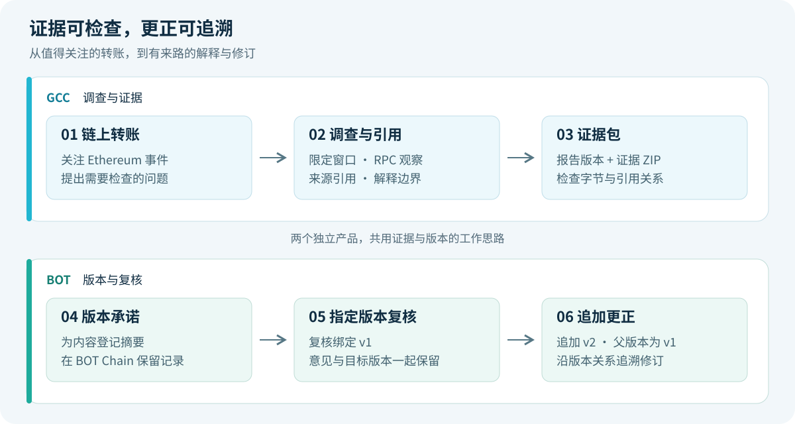

 

# ClueTide

**我们让链上解释带着证据，让每一次更正都有来路。**

*产品概念图：从链上调查到证据与版本复核。*

[**体验 GCC · 调查与证据 →**](https://hnnuyuxuan.github.io/cluetide-app/gcc/)　[**体验 BOT · 版本与复核 →**](https://hnnuyuxuan.github.io/cluetide-app/bot/)

## 为什么做 ClueTide

一笔值得关注的转账，可以引出几种截然不同的解释。我们需要知道解释来自哪些观察、覆盖多大的窗口、还有什么尚未核实；当证据变化，也需要看清是谁针对哪个版本提出复核，以及新版本如何承接旧版本。

我们把这条工作路径做成两个相互呼应的产品：**GCC 组织调查与证据，BOT 记录版本承诺与复核关系。** 两个产品各自运行，共用让结论可检查、让更正可追溯的设计。

## 从一笔 UNI 转账开始

**先在 GCC 看解释如何成立。** 我们围绕 Ethereum 历史事件限定观察窗口，把原始 RPC 观察、来源引用、候选解释和待核事项放在一起。打开 UNI 回放，再与 Euler 案例比较；沿引用检查报告，下载包含报告与证据的 ZIP，在浏览器中复验字节和引用关系。

*GCC 在线产品的实际界面。公开链上观察与明确标注的合成报告组成回放。*

**再在 BOT 看解释如何被复核。** 我们用 UNI 的真实归档模型报告展示 v1、绑定 v1 的复核，以及承接 v1 的更正 v2。选择版本、打开证据包，再查看对应主网记录，便能分别检查内容承诺和版本关系。两个产品以 UNI 串起阅读路径；各自的报告与演示资料保留独立来源。

*BOT 在线产品的实际界面：归档的原始模型报告与主网记录。*

我们将 BOT 主网 677 的合约部署、v1 登记、指定版本复核与 v2 追加归档为四笔成功交易，读者可通过[主网凭证](https://hnnuyuxuan.github.io/cluetide-app/bot/mainnet/bot-mainnet-workflow-20261008.json)核对。内容摘要对应证据字节，事实解释仍需核读证据。本次演示的作者与复核者使用同一钱包。

## 在线体验与本地运行

| 产品 | 公开静态体验 | 本地完整服务 |
| --- | --- | --- |
| **GCC** | UNI / Euler 回放、报告阅读、证据 ZIP 下载与浏览器复验 | 有限 finalized 窗口调查 API、持久化案件、证据导入与准确版本复核 |
| **BOT** | 英文版本时间线、归档主网凭证、证据文件校验 | 调查与案件 API、钱包交易准备、匹配案卷的回执及合约读取回验 |

在线页面适合先走完案例。本地服务支持自己的调查与保存；环境、依赖和启动步骤由对应产品分支维护。

## 源码与开发

| 产品 | 源码与启动说明 |
| --- | --- |
| **GCC** | [中文开发入口](https://github.com/HNNUYUXUAN/cluetide-review/tree/GCC) |
| **BOT** | [中文开发入口](https://github.com/HNNUYUXUAN/cluetide-review/blob/BOT/README.zh-CN.md) |

我们在各分支维护源码、启动步骤、依赖锁定和验证说明。自有源码采用 [MIT 许可](LICENSE)，证据素材及第三方组件随附各自来源与声明。

[产品发布与验证](docs/release.md) · [项目与主网凭证](docs/submission.md) · [English](README.en.md)

[配图来源](docs/readme-assets.md)
