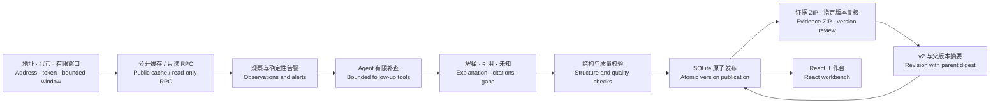

# ClueTide · GCC

**让团队带着证据，判断链上异动。**  
**From an Ethereum event to an explanation another person can verify.**

[项目总览 / Overview](https://github.com/HNNUYUXUAN/cluetide-review/tree/main) · [GCC Demo](https://hnnuyuxuan.github.io/cluetide-app/gcc/) · [BOT 赛道 / BOT track](https://github.com/HNNUYUXUAN/cluetide-review/tree/BOT) · [English](#english)


## 中文

ClueTide GCC 是 Ethereum 事件调查与证据复核工作台。调查从地址、ERC-20 代币和有限区块窗口开始：读取公开观察，识别需要解释的转账，按已有证据选择下一步补查，并把解释、引用和未知项交给下一位复核者。更正形成新版本，原版本和依据继续可查。

### 三分钟审阅

1. 打开 [UNI 案例](https://hnnuyuxuan.github.io/cluetide-app/gcc/#/demo/uniswap93)，查看 1 亿 UNI 的 Transfer、交易回执和治理来源。
2. 核对相邻区块的 supply 观察，切换 v1 / v2，查看更正如何明确证据边界。
3. 下载当前版本，在“证据包复验”中重新读取，核对文件摘要、引用与父版本关系。
4. 打开 [Euler 案例](https://hnnuyuxuan.github.io/cluetide-app/gcc/#/demo/euler-20230313)，比较另一类事件中的相同调查方法。
5. 按下方步骤运行本地服务，实际创建调查、提交版本复核和保存更正。

详细路线见 [审阅指南](docs/REVIEW.md)。仓库是私有审阅暂存库，访问源码需要仓库授权；正式递交的公开源码条件与链接核对见 [递交检查](docs/SUBMISSION.md)。

### 可以体验什么

| 能力 | 在线静态 Demo | 本地完整服务 |
| --- | --- | --- |
| 产品故事、UNI / Euler 引导回放 | ✓ | ✓ |
| 选择并下载 v1 / v2，浏览器本地 ZIP 复验 | ✓ | ✓ |
| 创建调查、查看工具轨迹和质量提示 | — | ✓ |
| 案件保存、服务端导入、指定版本复核与更正 | — | ✓ |

回放使用公开历史观察和明确标注的合成报告。本地启动默认使用公共缓存与离线模型；页面中的调查工作台需要同源 `/api`。浏览器复验在本地读取所选文件。

### 两个案卷，明确的证据范围

| 案例 | 调查窗口 | 可直接核对的观察 | 解释边界 |
| --- | --- | --- | --- |
| [Uniswap proposal 93](data/cases/uniswap93/README.md) | Ethereum 24106368–24106388，21 块 | Timelock 向 dead 地址转出 100,000,000 UNI；相邻供给读数均为 1,000,000,000 UNI | 转账、治理背景与供给状态分别核对；当前窗口支持有限解释 |
| [Euler 2023-03-13](data/cases/euler-20230313/README.md) | Ethereum 16817995–16817997，3 块 | Euler 主体 DAI 一笔流出、两笔流入，净 Transfer 流保留精确 raw 数值 | 净流只描述指定主体、代币和窗口；完整事件需更广材料 |

案卷保留原始请求与响应、来源定位和 SHA-256。远端 finalized 锚点依赖 RPC 提供者；摘要证明字节一致性，来源真实性和因果解释仍需复核。[来源与方法](SOURCE.md)说明这些边界。

### 架构



`src/cluetide` 提供采集、Agent、引用校验、质量提示、版本登记与 FastAPI；`frontend` 提供故事、回放、工作台与复验；`data/cases` 保留公开案卷；`tests` 和 `frontend/tests` 覆盖证据身份、精确金额、恢复和交接流程。评估核心支持强条件脚本、one-shot、adaptive 三种策略，解释比较时须同时说明证据覆盖、请求次数与运行条件。

### 本地运行

需要 **Python 3.12、Node.js 24、npm**。本轮在 Windows 实测；下方先克隆 GCC 分支，再执行 PowerShell 安装与启动命令：

```powershell
git clone --branch GCC --single-branch https://github.com/HNNUYUXUAN/cluetide-review.git cluetide-gcc
Set-Location cluetide-gcc
python -m venv .venv
.\.venv\Scripts\python.exe -m pip install -r requirements-lock.txt
Push-Location frontend
npm ci
npm run build
Pop-Location
.\scripts\run-local.ps1
```

打开 **http://127.0.0.1:5186/**。本地状态写入 `local-data/`；可通过 `CLUETIDE_DATA_DIR` 指定独立目录。开发服务器为 5187，构建预览为 4187，两者代理到本地 API 5186。Linux/macOS 命令、测试和打包见 [开发与验证](docs/DEVELOPMENT.md)。

```powershell
$env:CLUETIDE_DATA_DIR = Join-Path (Get-Location) 'local-only/test-state'
$env:CLUETIDE_TEST_PYTHON = Join-Path (Get-Location) '.venv/Scripts/python.exe'
.\.venv\Scripts\python.exe -m pytest -q
Push-Location frontend
npm test
npm run build
Pop-Location
```

浏览器组件测试需要 Python Playwright 和已安装的 Chrome；请核对 skipped 数量。[本版验证](docs/VALIDATION.md)按实际运行范围记录结果。

本次审阅目录已通过 **880 项全量后端测试、28 项前端测试（0 skipped）、生产构建与服务冒烟**。

### 来源与许可

GCC 审阅源码以 `1b2fdd5d152f51e99d28563e10db39c94d015e3f` 为来源，公开案卷、回放和第三方许可保留来源字节，选取和改编关系见 [SOURCE.md](SOURCE.md) 与 [source-manifest.json](source-manifest.json)。ClueTide 自有代码采用 [MIT License](LICENSE)；第三方代码、来源材料与摘录适用各自的署名及条款，见 [许可索引](data/attribution/README.md)。

---

## English

ClueTide GCC is an Ethereum investigation and evidence-review workbench. Start with an address, an ERC-20 token and a bounded block window. Inspect public observations, follow a suspicious transfer through additional reads, and hand over an explanation with citations and explicit knowledge gaps. Reviews bind to an exact version; corrections create a new version with a parent digest.

### Review in three minutes

1. Open the [UNI replay](https://hnnuyuxuan.github.io/cluetide-app/gcc/#/demo/uniswap93). Inspect the 100 million UNI transfer, its receipt and governance sources.
2. Compare adjacent supply reads and switch between v1 and v2 to inspect the scope clarification.
3. Download the selected evidence ZIP and verify it in the browser. Check hashes, citations and the parent-version relationship.
4. Open the [Euler replay](https://hnnuyuxuan.github.io/cluetide-app/gcc/#/demo/euler-20230313) to see the method applied to a different event.
5. Run the local service to create an investigation, review its exact version and publish a correction.

This private review repository requires reviewer access. [Submission notes](docs/SUBMISSION.md) distinguish repository access from the public-source requirement for formal submission.

### Demo and local service

The hosted static demo provides the story, UNI/Euler guided replays, version downloads and local browser ZIP verification. Creating investigations, server-side imports, persistent cases, reviews and revisions require the local FastAPI service. The replay combines public historical observations with visibly labelled synthetic reports. The default local launcher uses cached public evidence and an offline model.

The UNI case covers **21 blocks, 24106368–24106388**: a **100,000,000 UNI** transfer from the Timelock to the dead address, with adjacent supply reads of **1,000,000,000 UNI**. Transfer activity, governance context and supply state are separate evidence questions. The Euler case covers **three blocks, 16817995–16817997** and three DAI transfers involving the specified subject. Net transfer flow describes that subject, token and window; broader incident interpretation needs broader evidence.

Raw captures, source pointers and hashes accompany both cases. Provider-reported finalized anchors retain the provider trust assumption. Hash verification establishes byte consistency; factual accuracy and causal interpretation require source review. See [the reviewer guide](docs/REVIEW.md) and [provenance](SOURCE.md).

### Run and validate

Install **Python 3.12 and Node.js 24**. Release verification ran on Windows. The following Linux/macOS recipe has not been executed on this host; it clones the GCC branch before installation:

```bash
git clone --branch GCC --single-branch https://github.com/HNNUYUXUAN/cluetide-review.git cluetide-gcc
cd cluetide-gcc
python3.12 -m venv .venv
.venv/bin/python -m pip install -r requirements-lock.txt
cd frontend
npm ci
npm run build
cd ..
CLUETIDE_PREVIEW_ONLY=1 .venv/bin/python -m uvicorn cluetide.app:app --host 127.0.0.1 --port 5186
```

Open **http://127.0.0.1:5186/**. On Windows, use the PowerShell setup above and `scripts/run-local.ps1`. Keep a separate `CLUETIDE_DATA_DIR` for test state. Development runs on port 5187 and build preview on 4187; both proxy API requests to 5186.

```bash
CLUETIDE_DATA_DIR="$PWD/local-only/test-state" .venv/bin/python -m pytest -q
cd frontend
CLUETIDE_TEST_PYTHON="$(pwd)/../.venv/bin/python" npm test
npm run build
```

Browser component tests require Playwright in the selected Python runtime and an installed Chrome browser. Check the skipped-test count. [Development](docs/DEVELOPMENT.md) covers packaging and source integrity; [validation](docs/VALIDATION.md) records the checks actually performed for this release.

This review checkout passed **880 backend tests, 28 frontend tests (0 skipped), the production build and import/HTTP smoke checks**.

The architecture above separates read-only collection, bounded agent tools, citation/quality checks, atomic SQLite publication and exact-version handover. Review `src/cluetide`, `frontend`, `data/cases` and `tests` in that order. The evaluation engine includes a strongly conditioned script, one-shot and adaptive strategies; comparisons must state evidence coverage, request counts and operating conditions.

### Provenance and license

The product source derives from commit `1b2fdd5d152f51e99d28563e10db39c94d015e3f`. [SOURCE.md](SOURCE.md) and [source-manifest.json](source-manifest.json) describe selected files and adaptations. ClueTide's own code is [MIT licensed](LICENSE). Third-party code, public-source excerpts and supporting materials retain their applicable original notices and terms in [the attribution directory](data/attribution/README.md).
