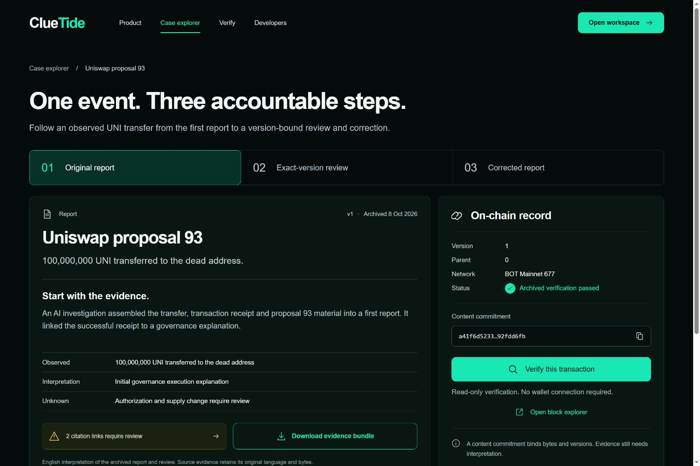
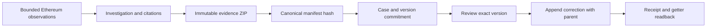

# ClueTide · BOT

**Every claim. A traceable history.**

ClueTide connects an evidence report, a review of its exact version, and a corrected report through verifiable content commitments on BOT Chain.

[Open the demo](https://hnnuyuxuan.github.io/cluetide-app/bot/) · [Explore the UNI case](https://hnnuyuxuan.github.io/cluetide-app/bot/#/cases/uniswap93) · [Review hub](https://github.com/HNNUYUXUAN/cluetide-review) · [GCC track](https://github.com/HNNUYUXUAN/cluetide-review/tree/GCC)


## Start with the case

A report about a 100,000,000 UNI transfer becomes more useful when another reader can identify exactly what was reviewed and what changed.

1. **Original report.** Open the UNI case and inspect v1's evidence commitment.
2. **Exact-version review.** The recorded review asks for a narrower interpretation and stays bound to v1.
3. **Corrected report.** v2 separates the observed transfer and successful receipt from governance authorization. Supply change remains unknown within this investigation.
4. **Inspect the record.** Open the transaction in the BOT mainnet explorer, download its evidence bundle, and use the verification page to check the file.



The two citation links flagged in the original reports still need review. The English case narrative is an explanatory adaptation; downloadable evidence preserves its original report bytes and language.

## Verified mainnet provenance

On **8 October 2026**, the author signed four transactions on **BOT Mainnet, chain ID 677**. The public RPC confirmed successful receipts, canonical blocks, the registry runtime, exact content commitments, and complete version/review getters. The application distinguishes this archived verification from a new readback.

**Registry:** [`0x951f7b5c68adba4cefd7fa851cb8e030426e81aa`](https://scan.botchain.ai/address/0x951f7b5c68adba4cefd7fa851cb8e030426e81aa)

| Step | Relationship | Transaction |
| --- | --- | --- |
| Registry deployment | Creation and runtime match the included artifact | [Open transaction](https://scan.botchain.ai/tx/0xd7d4d91b0b4158adb4da9cdccb0d71739fc670ba7801f382eb08742d3274fe8c) |
| v1 registration | Version 1, parent 0 | [Open transaction](https://scan.botchain.ai/tx/0x936c81539bfeafbc14cdd83ee27059d9979262267b74d3062aaef1e37804d398) |
| Exact-version review | Review 1 binds to version 1 | [Open transaction](https://scan.botchain.ai/tx/0x51af7682149dd9f28e6ceffe8e8044028d3ed437e2cfcfdc5f1dfa3facf7aabd) |
| Corrected version | Version 2, parent 1 | [Open transaction](https://scan.botchain.ai/tx/0xb1a45ace22fee58c97a0c218cb67deeea07cc5b778fa13371e730c56bda72328) |

The three business transactions consumed **0.02207558 BOT**; including deployment, the total was **0.04501682 BOT**. The final snapshot contains **two versions and one review**, with version 2 as the head and version 1 as its parent. The author and reviewer use the same wallet in this demonstration. Content commitments establish bytes and version relationships; factual support and reviewer independence require their own evidence.

The [mainnet proof archive](https://hnnuyuxuan.github.io/cluetide-app/bot/mainnet/bot-mainnet-workflow-20261008.json) provides the four transaction hashes, fees, receipt-file hashes, and complete final getters. Source receipts are in [data/demo](data/demo); the product snapshot is [bot-mainnet-story-data.json](frontend/src/bot-mainnet-story-data.json). The [historical testnet snapshot](frontend/src/bot-story-data.json) and its original receipts remain available as separate network records.

The contract's [Solidity source](contracts/ClueTideRegistry.sol) and [compiled artifact](contracts/artifacts/ClueTideRegistry.json) are included. Deployment verification matched creation and runtime bytecode to this artifact. Compiler: Solidity 0.8.30, Paris EVM, optimizer 200 runs.

## Product routes

| Route | Purpose |
| --- | --- |
| `#/` | Understand the product and the evidence lifecycle |
| `#/cases/uniswap93` | Follow v1, the review, and v2 with source and transaction links |
| `#/verify` | Inspect evidence-file integrity and recorded commitments |
| `#/developers` | Find architecture, source, network details, and setup |
| `#/workspace` | Run the local investigation and wallet workflow |

Hash routes work on GitHub Pages and support direct links. Both `index.html` and `bot.html` enter the English product. Existing local investigation query links and saved transaction intents continue to work.

## Online demo and local service

| Capability | GitHub Pages demo | Local application |
| --- | --- | --- |
| Product and UNI version story | Available | Available |
| Public evidence downloads and file checks | Available | Available |
| Recorded mainnet explorer links | Available | Available |
| Investigation API and persistent case history | Requires local service | Available |
| Transaction preparation and complete receipt/getter readback | Requires local service | Available |
| Wallet signing | User wallet through local workflow | Explicit wallet confirmation |

The static demo uses bundled public records. Starting the local application creates a separate local case store. Archived records refer to their archived local version identities; creating a fresh case does not recreate those identities or broadcast transactions.

## Run locally

Use **Python 3.12** and **Node.js 24**. Dependency versions are fixed in `requirements-lock.txt` and `frontend/package-lock.json`.

```powershell
git clone --branch BOT --single-branch https://github.com/HNNUYUXUAN/cluetide-review.git
cd cluetide-review
py -3.12 -m venv .venv
.\.venv\Scripts\python.exe -m pip install -r requirements-lock.txt
cd frontend
npm ci
npm run build
cd ..
.\scripts\run-local.ps1
```

Open **http://127.0.0.1:8765/**. The startup script enables offline preview with public snapshots and a deterministic model. Investigations, evidence export/import, local reviews, and corrections work without a model API key.

For Linux or macOS:

```bash
python3.12 -m venv .venv
. .venv/bin/activate
python -m pip install -r requirements-lock.txt
(cd frontend && npm ci && npm run build)
CLUETIDE_PREVIEW_ONLY=1 uvicorn cluetide.app:app --host 127.0.0.1 --port 8765
```

For frontend development, start the local API, then run `npm run dev` inside `frontend`. Vite proxies `/api` to port 8765. Production serves the frontend and API from the same origin. Keep the original origin when continuing saved browser transaction intents.

## How it works



- **Evidence:** four public data files plus a canonical manifest; exact byte lengths and SHA-256 checks; bounded archive import.
- **Registry:** author-controlled version append, same-case parent binding, and reviews tied to an exact version and content hash.
- **Preparation:** the backend rebuilds the intended call from saved evidence and version identity. The wallet presents the transaction for the user's confirmation.
- **Readback:** transaction, canonical block, receipt, runtime code, events, commitments, and getters are checked against the saved public intent.
- **Recovery:** sent transaction hashes and public context remain available for readback after a refresh. Account or network changes invalidate prepared signing context.
- **Scale:** chain reads use a fixed block snapshot; review preflight advances through bounded batches with resumable server cursors.

Ethereum is the investigation data source. BOT Testnet 968 and BOT Mainnet 677 are separate registry networks. The primary product presents the verified mainnet 677 deployment and workflow. Historical testnet 968 records retain their original network identity.

## Verify and build

```powershell
.\.venv\Scripts\python.exe -m pytest -q
.\.venv\Scripts\python.exe -m pip check
.\.venv\Scripts\python.exe scripts/build_bot_story_data.py --check
.\.venv\Scripts\python.exe scripts/build_bot_story_data.py --network mainnet --check
cd frontend
npm test
npm run build
cd ..
.\.venv\Scripts\python.exe scripts/package_demo.py --dry-run --include-demo
```

Tests cover archive integrity, publication consistency, exact-version review, BOT preparation/readback, wallet context, bounded RPC, and recovery. See [release validation](docs/validation.md) for the checks run for this release, and [source provenance](SOURCE.md) for the upstream baseline and selected files.

## License and review access

ClueTide source is provided under the [MIT License](LICENSE). Dependency notices and original license files are included in [data/attribution](data/attribution). Public case data retains its source references; generated design art is presentation imagery.

This repository is currently private at the author's request and prepared for open-source publication. The submission form's public-repository requirement requires publication before submission or an organizer-approved private-access arrangement. The linked demo is publicly accessible.
