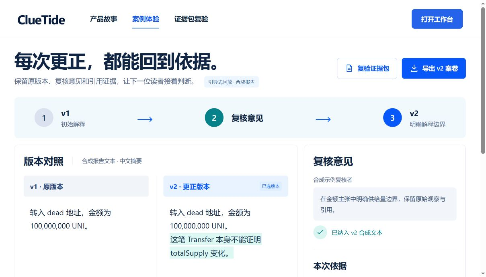
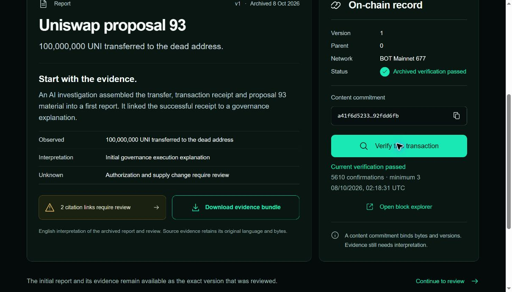
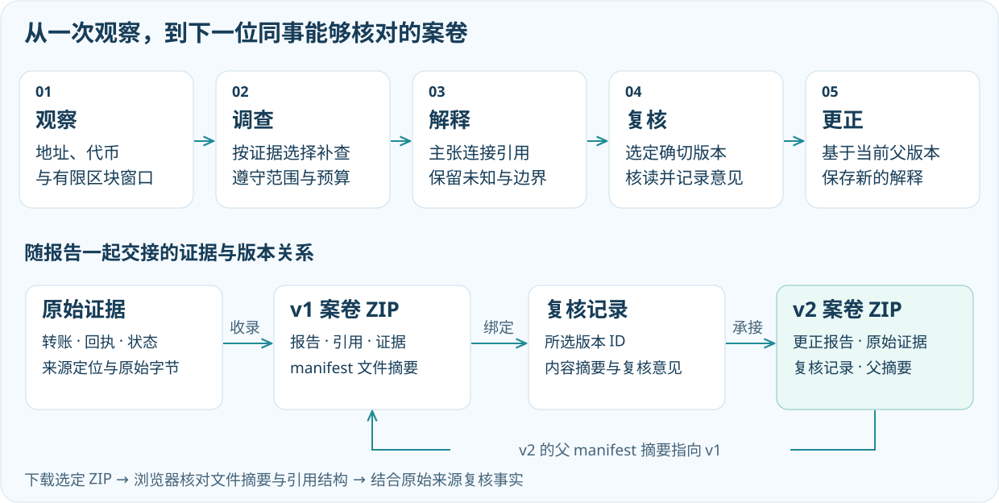

[](README.md) [](README.en.md)

# ClueTide · GCC

**让链上异动，成为一份能交接的解释。**

[打开在线体验](https://hnnuyuxuan.github.io/cluetide-app/gcc/) · [ClueTide 项目总览](https://github.com/HNNUYUXUAN/cluetide-review/tree/main) · [了解 BOT](https://github.com/HNNUYUXUAN/cluetide-review/blob/BOT/README.zh-CN.md)

一笔大额转账出现后，团队需要知道发生了什么，也需要知道下一位同事能否沿着相同证据重新判断。我们做 ClueTide GCC，是想把观察、补查、解释和复核连在一起：每项主张找到依据，每个未知保留位置，每次更正留下来处。


*产品概念插画；实际工作台与回放界面见下文。*

## 从 1 亿 UNI 开始

打开 [UNI 案例](https://hnnuyuxuan.github.io/cluetide-app/gcc/#/demo/uniswap93)，我们先看一件具体的事：在 Ethereum **24106368–24106388 的 21 块窗口**里，Timelock 向 dead 地址转出 **100,000,000 UNI**。回执支持这笔转账已经执行，提案 93 提供可以对照的治理背景。

接着看相邻区块的供给读数：两次 `totalSupply()` 均为 **1,000,000,000 UNI**。转账金额与总供给是需要分别核对的主张。这一处差别，决定了报告能说到哪里，也决定了我们还要查什么。

调查工作台从地址、ERC-20 代币和有限区块窗口出发。Agent 根据已有观察选择回执、交易、历史代币状态或来源材料，补查受调用预算和窗口约束。报告保留引用、解释与未知项，页面同时展示工具轨迹和质量提示，让你沿着依据阅读结论。


*实际产品界面：从公开历史观察逐步核对解释。*

## 一份解释，怎样交给下一位同事

我们把复核落在一个确切版本上。你选择 v1，意见就绑定 v1 的版本 ID 与内容摘要；作者在当前父版本上保存更正，形成 v2，原版本继续可读。新报告记录父版本 manifest 摘要，读者能核对这次修改承接的是哪一份案卷。

在 UNI 回放中，切换 v1 / v2，就能看到供给量边界怎样进入解释。公开回放使用真实历史观察与明确标注的合成报告，展示的是调查和更正流程。运行本地服务后，你可以亲自提交复核意见、修改解释并保存新版本；其中的作者和复核者是本地演示角色。


*实际产品界面：v1 / v2 合成报告与父版本关系。*

交接时，下载选定版本的 ZIP，在“证据包复验”中打开。浏览器在本地核对文件摘要与引用结构；回放还会核对 v2 与 v1 的父摘要关系。哈希帮助确认收到的字节，事实解释仍需对照原始来源。

案卷同时保留原始请求与响应、来源定位和 SHA-256，方便接手者沿着记录逐项回查，并核对取得范围。远端 finalized 锚点来自 RPC 提供者的报告；阅读时需要把提供者信任、字节一致性和解释的成立条件一起考虑。

再试试 [Euler DAI 案例](https://hnnuyuxuan.github.io/cluetide-app/gcc/#/demo/euler-20230313)：**16817995–16817997 的三块窗口**记录主体的一笔流出、两笔流入。相同方法让净 Transfer 流保留精确值，并把解释限定在主体、代币和窗口内；事件全貌需要继续补充材料。


*实际产品界面：选择证据 ZIP，在浏览器本地复验。*



## 亲手走完一次调查

[在线体验](https://hnnuyuxuan.github.io/cluetide-app/gcc/)可以直接阅读故事与案例，下载并复验案卷。本地服务让这条流程继续进入你自己的调查和版本记录。

| 体验 | 在线静态 Demo | 本地服务 |
| --- | :---: | :---: |
| UNI / Euler 回放、v1 / v2 下载、浏览器 ZIP 复验 | ✓ | ✓ |
| 创建调查、保存案件、查看工具轨迹 | — | ✓ |
| 服务端导入、指定版本复核与更正 | — | ✓ |

准备 **Python 3.12、Node.js 24 和 npm**，在 PowerShell 运行：

```powershell
git clone --branch GCC --single-branch https://github.com/HNNUYUXUAN/cluetide-review.git cluetide-gcc
Set-Location cluetide-gcc
python -m venv .venv
.\.venv\Scripts\python.exe -m pip install -r requirements-lock.txt
Push-Location frontend
npm ci
npm run build
Pop-Location
.\scripts\run-local.ps1
```

打开 [本地工作台](http://127.0.0.1:5186/)。默认使用公开缓存与离线模型，页面与 `/api` 由同一服务提供，案件保存在 `local-data/`。Windows 是本版验证平台；Linux/macOS 启动见 [English README](README.en.md)，测试、打包与配置见[开发说明](docs/DEVELOPMENT.md)，实测范围见[验证记录](docs/VALIDATION.md)。

我们保留[案卷原始来源](data/cases/uniswap93/README.md)、[Euler 证据范围](data/cases/euler-20230313/README.md)及[来源清单](source-manifest.json)，方便你继续核查。源码基线与证据来源见 [SOURCE.md](SOURCE.md)。自有代码采用 [MIT 许可](LICENSE)，第三方材料遵循[各自的署名与条款](data/attribution/README.md)。完整体验路线见[操作指南](docs/REVIEW.md)。

[配图来源](docs/readme-assets.md)
