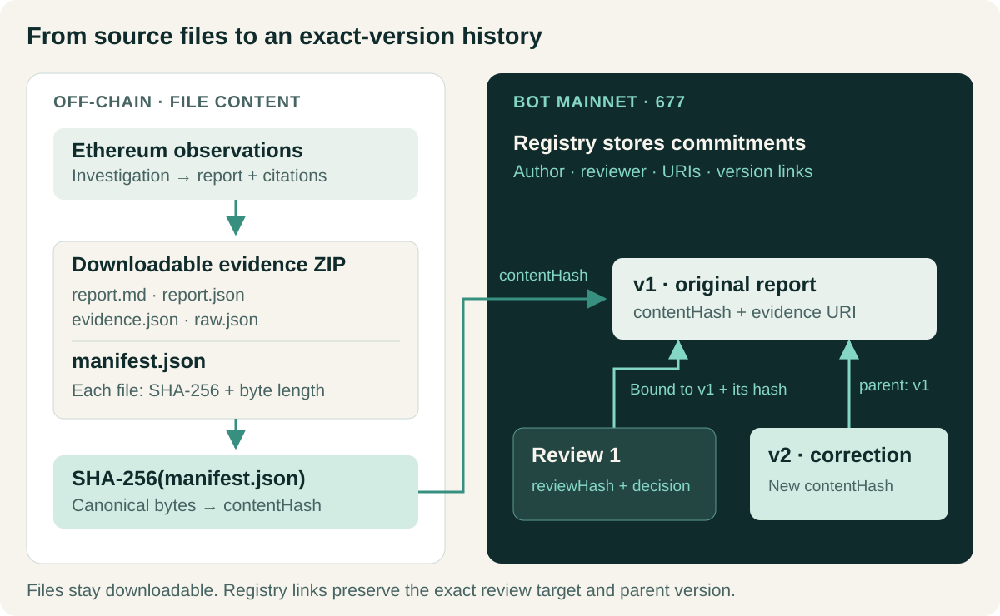

[](README.zh-CN.md) [](README.md)

# ClueTide · BOT

**Every claim. A traceable history.**

We build ClueTide so an investigation can keep improving while its evidence, reviews, and earlier conclusions remain inspectable. On BOT Chain, we connect each report's content commitment to the exact version someone reviewed and the correction that followed.


*Concept illustration of the product's evidence lifecycle. Explore the working application below.*

**[Open the demo](https://hnnuyuxuan.github.io/cluetide-app/bot/)** · [Follow the UNI case](https://hnnuyuxuan.github.io/cluetide-app/bot/#/cases/uniswap93) · [Verify a bundle](https://hnnuyuxuan.github.io/cluetide-app/bot/#/verify)

## Three actions, one continuing record

1. **Register a report.** Package the report, observations, and evidence into a downloadable ZIP. Record its canonical manifest hash as the version's content commitment.
2. **Review an exact version.** Attach a decision and review commitment to that version ID and content hash. A later report leaves the original review's target intact.
3. **Append a correction.** Publish the revised evidence commitment with the current version as its parent. Readers can follow what changed and return to the source material.

We want a reader to be able to ask three practical questions: What did this report say? What did the reviewer challenge? Which evidence and interpretation changed?

## Follow 100,000,000 UNI through v1, review, and v2

The case starts with an Ethereum transfer to the dead address. The first AI report linked a successful transaction receipt with an explanation involving Uniswap proposal 93. The review requested a narrower claim: separate the observed transfer and successful receipt from governance authorization.

The corrected report, v2, preserves those observations and bounds the governance explanation. Authorization still requires further investigation; supply change remains unknown because this investigation did not read the historical supply getters.


*Actual product screenshot of the recorded BOT Mainnet 677 case. Review 1 stays bound to v1; v2 has v1 as its parent.*

The author and reviewer used the same wallet in this demonstration. Two citation checks still flag missing matching raw RPC observations for receipt or transaction evidence. These are visible review questions. The English interface explains the case; downloaded archives preserve the original report bytes and language.

### Inspect the mainnet record

Our archived verification on **8 October 2026** checked four successful transactions on **BOT Mainnet, chain ID 677**, including deployment. Its final registry snapshot contains two versions and one review, with v2 as the head.

**Registry:** [`0x951f7b5c68adba4cefd7fa851cb8e030426e81aa`](https://scan.botchain.ai/address/0x951f7b5c68adba4cefd7fa851cb8e030426e81aa)

| Record | Transaction |
| --- | --- |
| Registry deployment | [Inspect deployment](https://scan.botchain.ai/tx/0xd7d4d91b0b4158adb4da9cdccb0d71739fc670ba7801f382eb08742d3274fe8c) |
| v1 · parent 0 | [Inspect v1](https://scan.botchain.ai/tx/0x936c81539bfeafbc14cdd83ee27059d9979262267b74d3062aaef1e37804d398) |
| Review 1 · bound to v1 | [Inspect review](https://scan.botchain.ai/tx/0x51af7682149dd9f28e6ceffe8e8044028d3ed437e2cfcfdc5f1dfa3facf7aabd) |
| v2 · parent v1 | [Inspect v2](https://scan.botchain.ai/tx/0xb1a45ace22fee58c97a0c218cb67deeea07cc5b778fa13371e730c56bda72328) |

Read the [mainnet proof and reproduction notes](docs/mainnet-proof.md) for receipt checks, fees, contract artifacts, and the complete archived snapshot. A fresh network readback has its own observation time.

## Evidence files off-chain, version relationships on-chain

Ethereum supplies the investigation data. BOT stores the registry's content commitments and version relationships. Each downloadable ZIP contains four content files and a canonical manifest recording their hashes and byte lengths. The SHA-256 of that manifest becomes the registered `contentHash`.



The registry records the author, evidence URI, parent version, and review metadata. Report and evidence bytes remain in the downloadable files. The local service prepares transactions from saved evidence; your wallet confirms signing. Readback checks the saved intent against the transaction, receipt, canonical block, deployed code, events, and getters.

Hashes establish file integrity; the registry records exact version relationships. Assessing a claim's interpretation, source authenticity, and reviewer independence still requires reading its supporting evidence.

## Download it. Check it. Read it.

Open the [verification page](https://hnnuyuxuan.github.io/cluetide-app/bot/#/verify), download either original evidence bundle, and select the ZIP to inspect its files and manifest commitment. Compare the result with its registered version, then follow the report's evidence references.

With the local service running, use **Verify this transaction** in a case to read its recorded transaction back from BOT.


*Actual local-service interface after read-only verification of v1: 5,610 confirmations at 02:18:31 UTC on 8 October 2026. The two citation questions remain visible.*

The hosted demo provides the case, downloads, browser file checks, and recorded explorer links. Running locally adds investigations, persistent case history, transaction preparation, and full receipt/getter readback. A fresh local case store creates its own version identities.

## Run your own workspace

Use **Python 3.12** and **Node.js 24**. From PowerShell:

```powershell
git clone --branch BOT --single-branch https://github.com/HNNUYUXUAN/cluetide-review.git
cd cluetide-review
py -3.12 -m venv .venv
.\.venv\Scripts\python.exe -m pip install -r requirements-lock.txt
cd frontend
npm ci
npm run build
cd ..
.\scripts\run-local.ps1
```

Open **http://127.0.0.1:8765/**. The launcher uses public snapshots and a deterministic model for offline preview. Try investigations, evidence export/import, local reviews, and corrections without a model API key. Dependency versions are fixed in the Python and frontend lockfiles.

## Build with us

Start with the [developer view](https://hnnuyuxuan.github.io/cluetide-app/bot/#/developers), [registry contract](contracts/ClueTideRegistry.sol), [local service](src/cluetide), and [product UI](frontend/src/product). The [technical notes](docs/mainnet-proof.md) include POSIX setup and verification commands; [release validation](docs/validation.md) records the actual checks, and [source provenance](SOURCE.md) identifies the release baseline.

Explore the [ClueTide project](https://github.com/HNNUYUXUAN/cluetide-review/blob/main/README.en.md) and the [GCC investigation track](https://github.com/HNNUYUXUAN/cluetide-review/blob/GCC/README.en.md). Bring a report, inspect its evidence, and help make the next version more precise.

ClueTide's code uses the [MIT License](LICENSE). Original source references and [dependency notices](data/attribution) travel with their artifacts.

[Image sources](docs/readme-assets.md)
