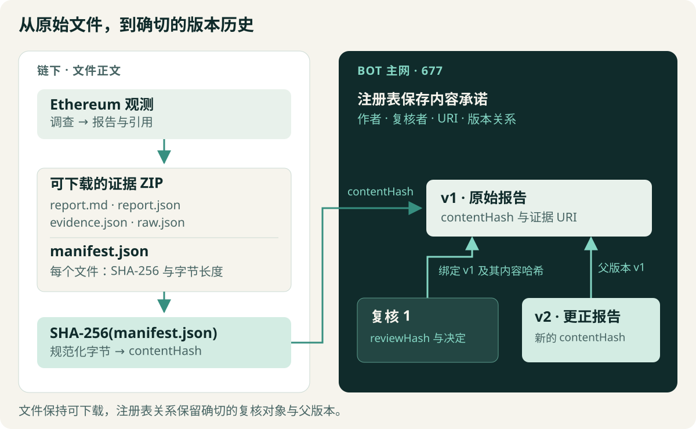

[](README.zh-CN.md) [](README.md)

# ClueTide · BOT

**每个判断，都有可追溯的历史。**

我们构建 ClueTide，让调查持续改进，也让证据、复核意见和早期结论始终可查。在 BOT Chain 上，我们把报告的内容承诺、复核针对的确切版本，以及随后产生的更正连接起来。


*产品证据生命周期的概念插画。下方入口可体验实际应用。*

**[打开在线演示](https://hnnuyuxuan.github.io/cluetide-app/bot/)** · [阅读 UNI 案例](https://hnnuyuxuan.github.io/cluetide-app/bot/#/cases/uniswap93) · [核验证据包](https://hnnuyuxuan.github.io/cluetide-app/bot/#/verify)

## 三个动作，延续一条记录

1. **登记报告。** 将报告、观测和证据打包为可下载的 ZIP，把规范化清单的哈希登记为这一版本的内容承诺。
2. **复核确切版本。** 将复核决定和复核内容承诺绑定到指定版本 ID 与内容哈希。报告更新后，原复核仍指向原来的对象。
3. **追加更正。** 以当前版本为父版本，登记修订后的证据内容承诺。读者可以追踪改动，并回到对应的原始材料。

我们希望读者能够回答三个具体问题：报告当时说了什么？复核者质疑了什么？哪些证据与解释发生了变化？

## 从一亿 UNI 看 v1、复核与 v2

案例从 Ethereum 上一笔转向 dead 地址的 UNI 转账开始。首份 AI 报告将成功的交易回执与 Uniswap 提案 93 的治理解释联系起来。复核要求收窄判断：把实际观察到的转账和成功回执，与治理授权的核实分开。

更正后的 v2 保留这些观测，并限定治理解释的范围。授权仍需进一步调查；本轮调查没有读取历史供应量 getter，因此供应量变化保持未知。


*记录于 BOT 主网 677 的实际产品案例截图。复核 1 始终绑定 v1；v2 的父版本为 v1。*

本次演示的作者与复核者使用同一钱包。两项引用检查仍提示：回执或交易证据缺少匹配的原始 RPC 观测。这些待复核问题在产品中可见。英文界面提供案例解释；下载的证据包保留报告的原始字节与语言。

### 查看主网记录

我们在 **2026 年 10 月 8 日**的归档核验中，检查了 **BOT 主网，链 ID 677** 上包括部署在内的四笔成功交易。最终注册表快照包含两个版本和一条复核，当前头版本为 v2。

**注册表合约：** [`0x951f7b5c68adba4cefd7fa851cb8e030426e81aa`](https://scan.botchain.ai/address/0x951f7b5c68adba4cefd7fa851cb8e030426e81aa)

| 记录 | 交易 |
| --- | --- |
| 注册表部署 | [查看部署](https://scan.botchain.ai/tx/0xd7d4d91b0b4158adb4da9cdccb0d71739fc670ba7801f382eb08742d3274fe8c) |
| v1 · 父版本 0 | [查看 v1](https://scan.botchain.ai/tx/0x936c81539bfeafbc14cdd83ee27059d9979262267b74d3062aaef1e37804d398) |
| 复核 1 · 绑定 v1 | [查看复核](https://scan.botchain.ai/tx/0x51af7682149dd9f28e6ceffe8e8044028d3ed437e2cfcfdc5f1dfa3facf7aabd) |
| v2 · 父版本 v1 | [查看 v2](https://scan.botchain.ai/tx/0xb1a45ace22fee58c97a0c218cb67deeea07cc5b778fa13371e730c56bda72328) |

[主网证明与复现说明](docs/mainnet-proof.md)收录回执检查、费用、合约产物和完整归档快照。重新读取网络时，结果对应新的观测时间。

## 文件保存在链下，版本关系记录在链上

Ethereum 提供调查数据，BOT 保存注册表中的内容承诺与版本关系。每个可下载 ZIP 包含四个内容文件，以及记录其哈希和字节长度的规范化清单。清单本身的 SHA-256 成为登记的 `contentHash`。



注册表记录作者、证据 URI、父版本和复核元数据；报告与证据正文保留在下载文件中。本地服务根据已保存的证据准备交易，由你的钱包确认签名。回读时，系统将已保存的交易意图与交易、回执、规范区块、部署代码、事件和 getter 逐项核对。

哈希用于核验文件完整性；注册表记录确切的版本关系。判断解释是否成立、来源是否真实，以及复核者是否独立，仍需阅读相应证据。

## 下载、核验，再读证据

打开[核验页](https://hnnuyuxuan.github.io/cluetide-app/bot/#/verify)，下载任一原始证据包，再选择 ZIP 检查文件和清单内容承诺。将结果与登记版本对照，然后沿着报告中的引用阅读证据。

运行本地服务后，在案例中使用 **Verify this transaction**，即可从 BOT 回读已记录的交易。


*本地服务对 v1 完成只读核验后的实际界面：2026 年 10 月 8 日 02:18:31 UTC，5,610 次确认。两项引用待复核问题仍在界面中可见。*

在线演示提供案例、下载、浏览器文件检查和已记录的区块浏览器链接。本地运行后，可使用调查、持久化案件历史、交易准备和完整回执/getter 回读。新建的本地案件库会生成自己的版本标识。

## 运行自己的工作台

使用 **Python 3.12** 与 **Node.js 24**，在 PowerShell 中执行：

```powershell
git clone --branch BOT --single-branch https://github.com/HNNUYUXUAN/cluetide-review.git
cd cluetide-review
py -3.12 -m venv .venv
.\.venv\Scripts\python.exe -m pip install -r requirements-lock.txt
cd frontend
npm ci
npm run build
cd ..
.\scripts\run-local.ps1
```

打开 **http://127.0.0.1:8765/**。启动脚本通过公开快照和确定性模型提供离线预览，无需模型 API 密钥即可体验调查、证据导出与导入、本地复核和更正。Python 与前端依赖版本均由锁定文件固定。

## 一起构建

从[开发者页面](https://hnnuyuxuan.github.io/cluetide-app/bot/#/developers)、[注册表合约](contracts/ClueTideRegistry.sol)、[本地服务](src/cluetide)和[产品界面](frontend/src/product)开始。[技术说明](docs/mainnet-proof.md)提供 POSIX 启动与校验命令；[发布验收](docs/validation.md)记录实际执行的检查，[来源说明](SOURCE.md)给出发布基线。

继续了解 [ClueTide 项目](https://github.com/HNNUYUXUAN/cluetide-review/tree/main)与 [GCC 调查路线](https://github.com/HNNUYUXUAN/cluetide-review/tree/GCC)。带上一份报告，核对它的证据，和我们一起让下一版判断更准确。

ClueTide 代码采用 [MIT 许可](LICENSE)。原始来源引用和[依赖许可说明](data/attribution)随相应产物保留。

[配图来源](docs/readme-assets.md)
