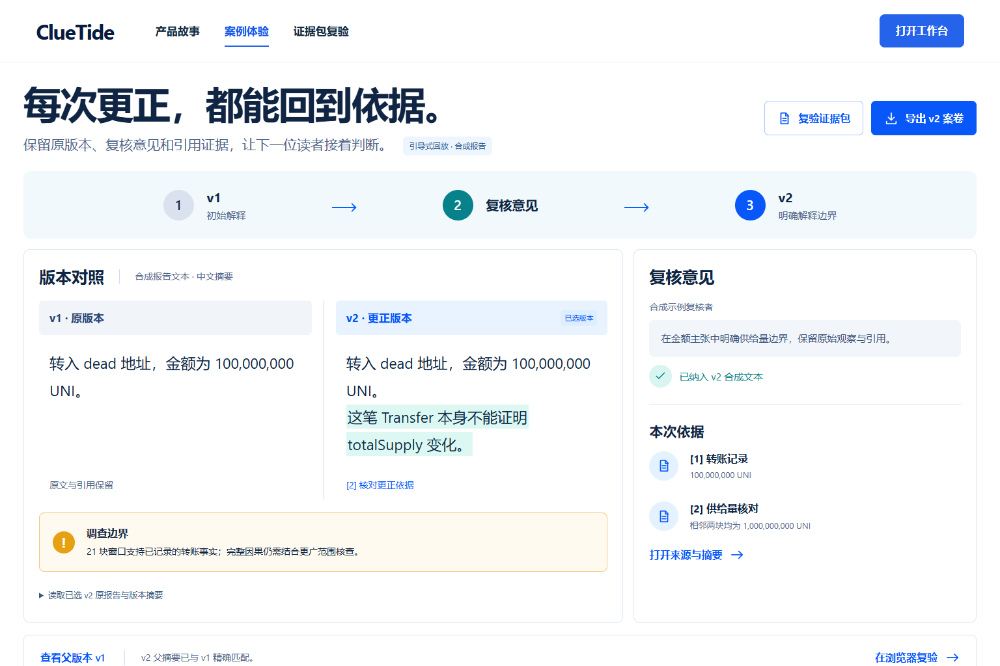

# GCC 审阅指南 / Reviewer guide

## 中文路线

**问题。** 大额转账提供线索，调查人员需要知道现有证据支持什么、还有什么未知，以及如何让下一位读者重查原依据。

**UNI。** 从故事首页打开 UNI 回放，检查地址、21 块窗口、精确转账金额及回执来源，再打开治理材料和供给观察。v2 明确该笔 Transfer 与 totalSupply 判断之间的证据边界。切换版本后下载，确认选择决定下载内容。

**Euler。** 查看三块窗口内的 DAI 一出两入。净 Transfer 流只对应指定地址、代币和窗口。事件复盘来源提供背景，getter 返回的 DAI 供给状态与 Euler 内部债务健康状态属于不同问题。

**交接。** 将下载的 ZIP 放入复验页，检查固定成员、规范 JSON、内容摘要、引用和版本父摘要。本地服务启动后可以导入准确旧版本、提交针对该版本的复核，并按明确父版本保存更正。

此图为 2026-10-08 已验收 UI 截图。回放报告为合成示例，公开链上观察和来源标识保留在页面及 ZIP 内。

## English route

**Question.** A large transfer is a starting point. An investigator needs a scoped explanation, explicit uncertainty and evidence another reader can inspect.

**UNI.** Open the UNI replay. Check the address, 21-block window, exact amount and transaction receipt, then inspect governance sources and supply observations. Version 2 clarifies what the Transfer can establish about supply. Change the selected version and verify that the download follows that selection.

**Euler.** Inspect one outgoing and two incoming DAI transfers within the three-block window. Net transfer flow is specific to the subject, token and window. Postmortem sources add context; DAI supply getters and Euler's internal debt health answer different questions.

**Handover.** Load the downloaded ZIP in the verification tool. It checks the fixed members, canonical JSON, digests, citations and parent-version relationship. With the local service running, import an exact historical version, review that version and save a correction against an explicit parent.

The image above is an accepted UI capture dated 2026-10-08. Replay reports are synthetic examples; the page and evidence ZIP retain labels for public observations and their sources.

## 检查入口 / Code entry points

| Concern / 问题 | Entry / 入口 |
| --- | --- |
| Public case scope / 公开范围 | `data/cases/*/README.md`, `case_catalog.py`, `investigation_scope.py` |
| Agent tool selection / 补查选择 | `src/cluetide/agent.py`, `evaluation.py` |
| Citation and amount checking / 引用与金额 | `citation_validation.py`, `report_quality.py` |
| Evidence import / 证据导入 | `src/cluetide/bundles.py`, `frontend/public/gcc-demo/bundle.js` |
| Exact-version review / 准确版本复核 | `registry.py`, `store.py`, `frontend/src/state` |

LocalRegistry uses user-entered role labels for controlled demonstrations. Independent reviewer identity and causal truth require evidence beyond those labels and byte digests. / LocalRegistry 的角色标签用于受控演示；独立身份和因果真实性需要标签与字节摘要之外的证据。
